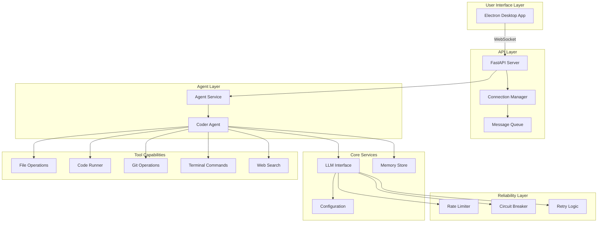
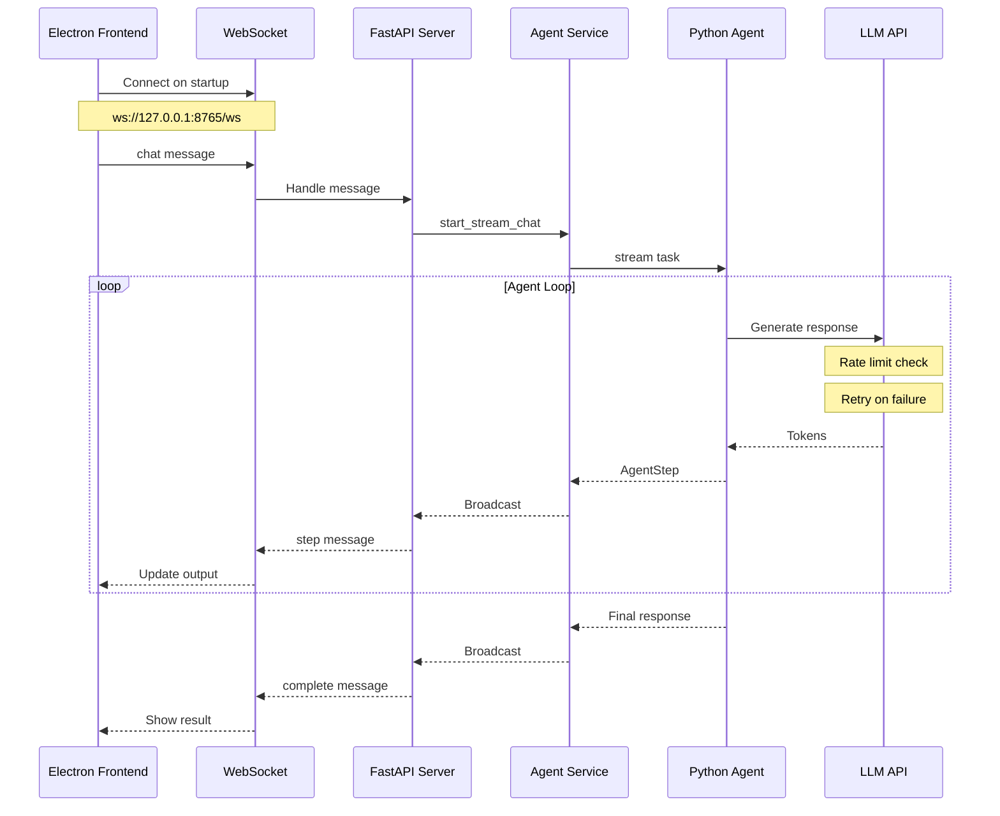
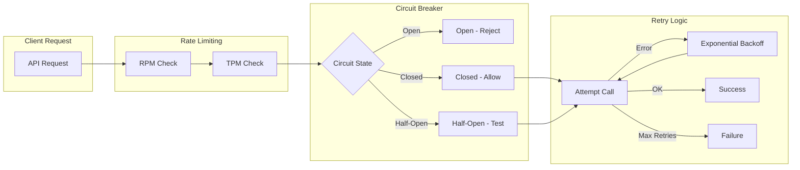
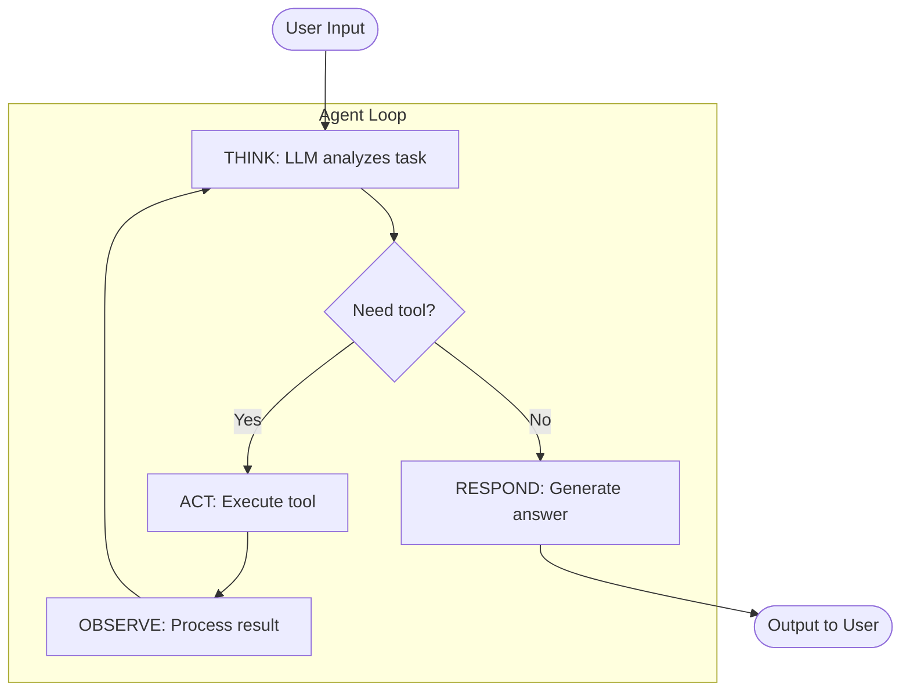
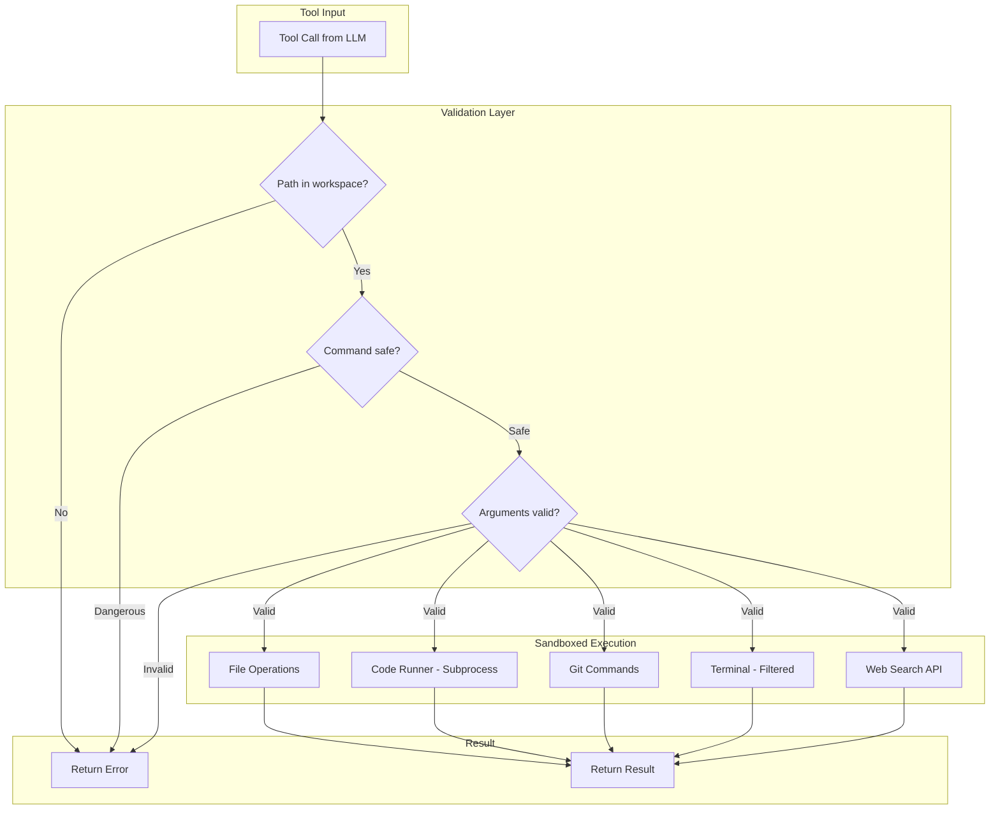
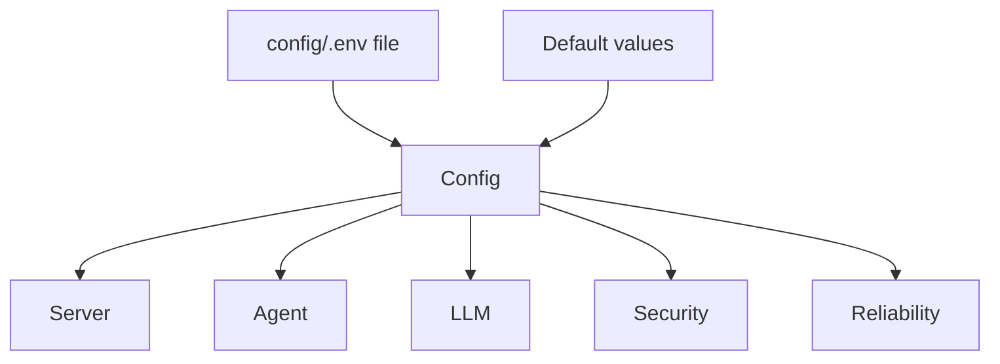

# SlowHands Architecture

This document describes the high-level logical architecture of SlowHands, a learning-focused AI coding agent with a VS Code-style desktop interface.

## System Overview



## Communication Architecture

The frontend and backend communicate via HTTP and WebSocket:



## API Endpoints

| Method | Endpoint | Purpose |
|--------|----------|---------|
| GET | `/health` | Server health check with metrics |
| GET | `/api/files` | List workspace files |
| GET | `/api/files/{path}` | Read file content |
| POST | `/agent/chat` | Synchronous chat |
| POST | `/agent/stream` | Start streaming response |
| POST | `/agent/reset` | Reset conversation history |
| POST | `/agent/stop` | Stop agent execution |
| WS | `/ws` | Real-time bidirectional communication |

### WebSocket Message Types

**Client to Server:**
```json
{"type": "chat", "content": "Your message here", "correlation_id": "..."}
{"type": "stop", "correlation_id": "..."}
{"type": "open_file", "path": "relative/path/to/file"}
{"type": "ping"}
```

**Server to Client:**
```json
{"type": "step", "step_number": 1, "phase": "think", "content": "..."}
{"type": "complete", "step_number": 3, "phase": "complete", "content": "..."}
{"type": "file_content", "path": "...", "content": "...", "size": 123}
{"type": "error", "content": "Error message"}
{"type": "stopped", "correlation_id": "..."}
{"type": "pong"}
```

## Reliability Architecture

SlowHands includes comprehensive reliability features:



### Reliability Components

| Component | Purpose | Configuration |
|-----------|---------|---------------|
| Rate Limiter | Prevent API quota exhaustion | `RATE_LIMIT_RPM`, `RATE_LIMIT_TPM` |
| Circuit Breaker | Fail fast on repeated errors | `CIRCUIT_BREAKER_THRESHOLD`, `CIRCUIT_BREAKER_TIMEOUT` |
| Retry Logic | Handle transient failures | `RETRY_ATTEMPTS`, `RETRY_MIN_WAIT`, `RETRY_MAX_WAIT` |
| Tool Retry | Retry failed tool executions | `TOOL_RETRY_ATTEMPTS` |

## The Agent Loop

The core reasoning loop follows Think -> Act -> Observe pattern:



## Tool Safety Architecture



## Configuration



### Configuration Categories

| Category | Key Options |
|----------|-------------|
| **LLM** | `LLM_PROVIDER`, `*_API_KEY`, `MODEL`, `TEMPERATURE`, `MAX_TOKENS` |
| **Agent** | `SLOW_MODE`, `MAX_ITERATIONS`, `VERBOSE` |
| **Safety** | `ALLOW_CODE_EXECUTION`, `ALLOW_GIT_OPERATIONS`, `ALLOW_TERMINAL_EXECUTION` |
| **Security** | `ENABLE_DEBUG_LOGGING`, `ALLOWED_CORS_ORIGINS`, `MAX_WS_MESSAGE_SIZE` |
| **Reliability** | `REQUEST_TIMEOUT`, `RETRY_ATTEMPTS`, `RATE_LIMIT_RPM`, `CIRCUIT_BREAKER_*` |

## File Map

| File | Responsibility |
|------|----------------|
| **Backend Core** | |
| `app/src/server.py` | FastAPI server with WebSocket, CORS |
| `app/src/agent.py` | Agent loop logic, tool orchestration |
| `app/src/llm.py` | Multi-provider LLM interface |
| `app/src/config.py` | Configuration loading and validation |
| `app/src/memory.py` | Conversation history management |
| **Backend Services** | |
| `app/src/services.py` | Agent service layer |
| `app/src/connection_manager.py` | WebSocket connection management |
| `app/src/message_queue.py` | Message queue for broadcasts |
| `app/src/ws_types.py` | WebSocket message type definitions |
| **Reliability** | |
| `app/src/reliability.py` | Rate limiter, circuit breaker, retry |
| `app/src/logging_config.py` | Structured logging setup |
| **Tools** | |
| `app/src/tools/base.py` | Tool base class and result types |
| `app/src/tools/file_ops.py` | File read/write/list operations |
| `app/src/tools/code_runner.py` | Sandboxed Python execution |
| `app/src/tools/git_tool.py` | Git version control operations |
| `app/src/tools/terminal_tool.py` | Filtered terminal command execution |
| `app/src/tools/web_search_tool.py` | Web search via SerpAPI |
| **Frontend** | |
| `frontend/electron/main.ts` | Electron main process |
| `frontend/electron/preload.ts` | Electron preload script |
| `frontend/src/main.ts` | Application entry point |
| `frontend/src/api.ts` | API client with WebSocket |
| `frontend/src/editor.ts` | Monaco editor manager |
| `frontend/src/ui.ts` | UI state management |
| `frontend/src/types.ts` | TypeScript type definitions |
| `frontend/src/style.css` | Theme styles |

## Running the Application

### Quick Start

```bash
./slowhands.sh
```

### Manual Start

```bash
# Terminal 1: Backend
cd app
pip install -r requirements.txt
python run_server.py
# Server runs on http://127.0.0.1:8765

# Terminal 2: Frontend
cd frontend
npm install
npm run dev
```

## Future Extensions

| Category | Planned Features |
|----------|------------------|
| **UI** | Custom themes, multi-tab editor, integrated terminal |
| **Agents** | Planner agent, code reviewer, test writer |
| **Tools** | Database access, container management |
| **Reliability** | Persistent sessions, checkpointing |

---

*View this file with a Mermaid renderer to see the diagrams.*
