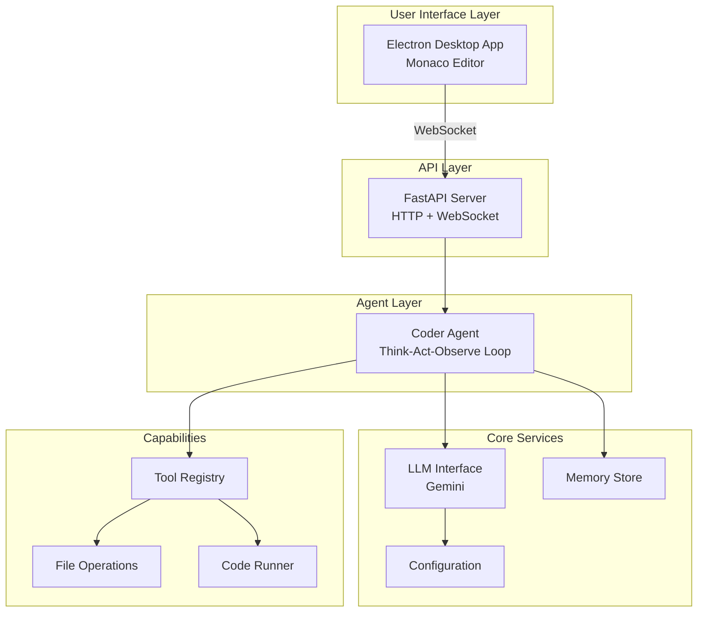
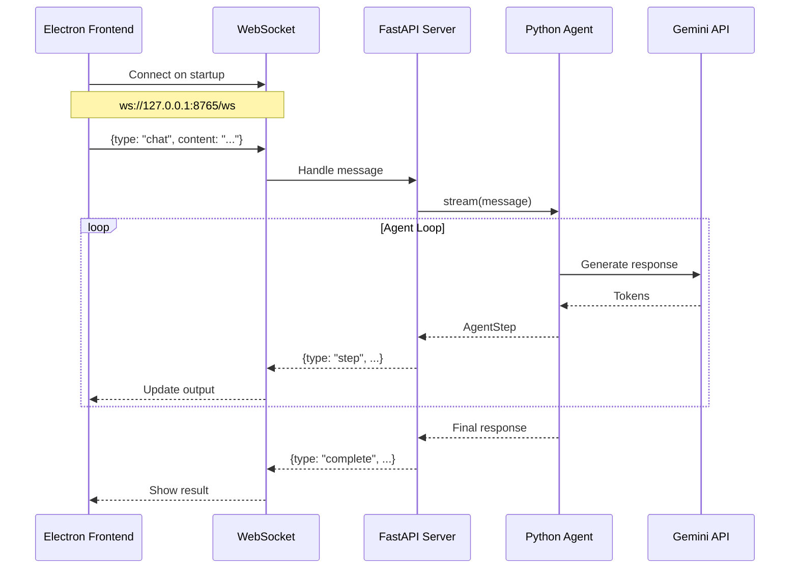
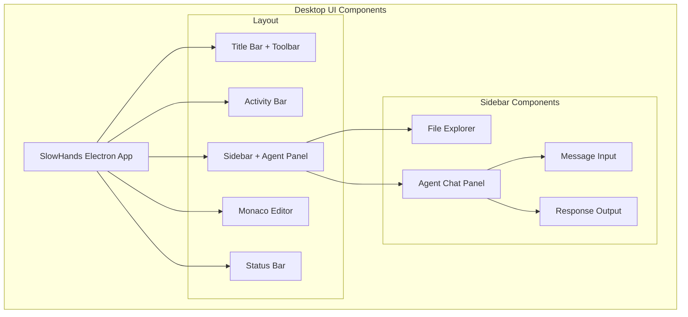
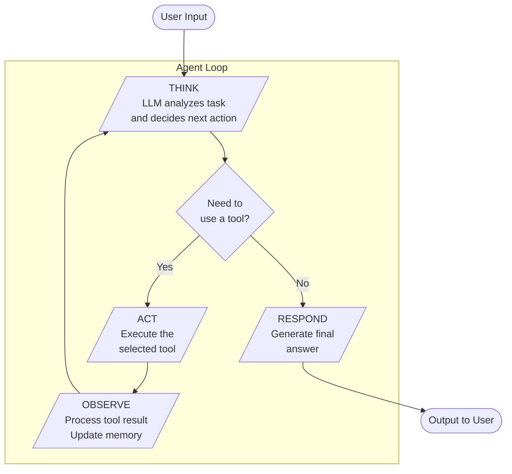
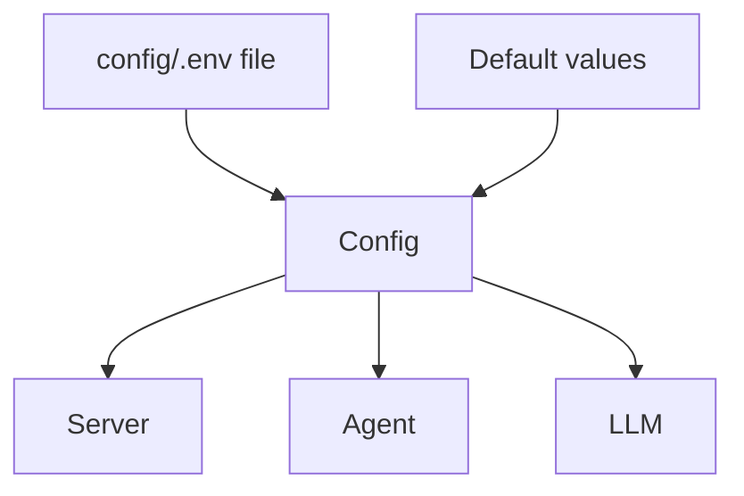
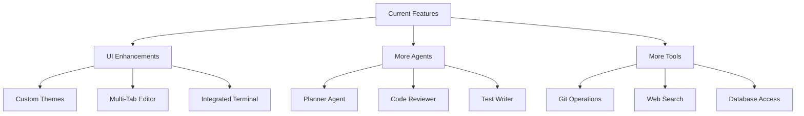

# SlowHands Architecture

This document describes the high-level logical architecture of SlowHands, a learning-focused AI coding agent with a VS Code-style desktop interface.

## System Overview



## Communication Architecture

The frontend and backend communicate via HTTP and WebSocket:



## API Endpoints

| Method | Endpoint | Purpose |
|--------|----------|---------|
| GET | `/health` | Server health check |
| POST | `/agent/chat` | Synchronous chat (waits for full response) |
| POST | `/agent/stream` | Start streaming response |
| POST | `/agent/reset` | Reset conversation history |
| WS | `/ws` | Real-time bidirectional communication |

### WebSocket Message Types

**Client to Server:**
```json
{"type": "chat", "content": "Your message here"}
{"type": "ping"}
```

**Server to Client:**
```json
{"type": "step", "step_number": 1, "phase": "think", "content": "..."}
{"type": "complete", "step_number": 3, "phase": "complete", "content": "..."}
{"type": "error", "content": "Error message"}
{"type": "pong"}
```

## User Interface Architecture

SlowHands provides a VS Code-style desktop interface built with Electron and Monaco Editor:



### Key UI Features

| Component | Purpose |
|-----------|---------|
| Title Bar | Draggable window area + File/Edit/View/Help menus |
| Activity Bar | Navigation icons (Explorer, Search, Debug) |
| Sidebar | Resizable file explorer + agent chat panel |
| Agent Panel | Input for messages, shows last 2 output lines |
| Monaco Editor | Full VS Code editor with syntax highlighting |
| Status Bar | Connection status, model info |

### Theme (Light)

```css
:root {
    --bg-titlebar: #f0f0f0;
    --bg-activity-bar: #f3f3f3;
    --bg-sidebar: #f8f8f8;
    --bg-editor: #ffffff;
    --bg-statusbar: #0078d4;
    --text-primary: #1e1e1e;
    --accent: #0078d4;
}
```

## The Agent Loop

The core reasoning loop follows Think → Act → Observe pattern:



## Configuration



### Configuration Options

| Option | Default | Description |
|--------|---------|-------------|
| `LLM_PROVIDER` | gemini | LLM provider (openai, anthropic, deepseek, gemini) |
| `GEMINI_API_KEY` | - | Your Gemini API key |
| `MODEL` | gemini-2.0-flash | Model to use |
| `MAX_ITERATIONS` | 10 | Loop safety limit |
| `REQUEST_TIMEOUT` | 60.0 | API request timeout in seconds |

## File Map

| File | Responsibility |
|------|----------------|
| **Backend** | |
| `app/src/server.py` | FastAPI server with WebSocket |
| `app/src/agent.py` | Agent loop logic |
| `app/src/llm.py` | LLM API communication (Gemini) |
| `app/src/config.py` | Configuration loading |
| `app/src/memory.py` | Conversation history |
| `app/src/tools/base.py` | Tool base class |
| `app/src/tools/file_ops.py` | File operations |
| `app/src/tools/code_runner.py` | Code execution |
| `app/run_server.py` | Server entry point |
| **Frontend** | |
| `frontend/electron/main.ts` | Electron main process |
| `frontend/electron/preload.ts` | Electron preload script |
| `frontend/src/main.ts` | Monaco editor + WebSocket client |
| `frontend/src/style.css` | Light theme styles |
| `frontend/index.html` | UI layout |

## Running the Application

### 1. Start the Python Backend

```bash
cd app
pip install -r requirements.txt
python run_server.py
```

Server runs on `http://127.0.0.1:8765`

### 2. Start the Electron Frontend

```bash
cd frontend
npm install
npm run dev
```

## Future Extensions



---

*View this file in Obsidian or [Mermaid Live Editor](https://mermaid.live) to see the diagrams rendered.*
