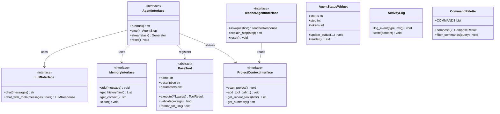

# SlowHands Interface Contracts

This document defines all interfaces, data models, and contracts used in SlowHands.

## Core Interfaces

### Agent Interface

```python
from abc import ABC, abstractmethod
from typing import Generator
from dataclasses import dataclass

@dataclass
class AgentStep:
    """Represents a single step in the agent loop."""
    step_number: int
    phase: str  # "think", "act", "observe", "respond"
    content: str
    tool_call: Optional["ToolCall"] = None
    tool_result: Optional["ToolResult"] = None

class AgentInterface(ABC):
    """Abstract interface for the agent."""

    @abstractmethod
    def run(self, task: str) -> str:
        """
        Run the agent on a task until completion.

        Args:
            task: The user's request/task description

        Returns:
            The final response from the agent
        """
        pass

    @abstractmethod
    def step(self) -> AgentStep:
        """
        Execute a single step of the agent loop.

        Returns:
            AgentStep with details about what happened
        """
        pass

    @abstractmethod
    def stream(self, task: str) -> Generator[AgentStep, None, None]:
        """
        Stream agent steps as they happen.

        Yields:
            AgentStep for each step in the loop
        """
        pass

    @abstractmethod
    def reset(self) -> None:
        """Reset the agent state for a new task."""
        pass
```

### Tool Interface

```python
from abc import ABC, abstractmethod
from dataclasses import dataclass, field
from typing import Any, Dict, Optional

@dataclass
class ToolResult:
    """Result of a tool execution."""
    success: bool
    output: str
    error: Optional[str] = None
    metadata: Dict[str, Any] = field(default_factory=dict)

    def __str__(self) -> str:
        if self.success:
            return self.output
        return f"Error: {self.error}"

@dataclass
class ToolCall:
    """Represents a request to call a tool."""
    tool_name: str
    arguments: Dict[str, Any]
    call_id: str  # Unique identifier for this call

class BaseTool(ABC):
    """Abstract base class for all tools."""

    @property
    @abstractmethod
    def name(self) -> str:
        """Unique name for this tool."""
        pass

    @property
    @abstractmethod
    def description(self) -> str:
        """Description shown to the LLM."""
        pass

    @property
    @abstractmethod
    def parameters(self) -> Dict[str, Any]:
        """JSON Schema for tool parameters."""
        pass

    @abstractmethod
    def execute(self, **kwargs) -> ToolResult:
        """
        Execute the tool with given arguments.

        Args:
            **kwargs: Tool-specific arguments

        Returns:
            ToolResult with success status and output
        """
        pass

    def validate(self, kwargs: Dict[str, Any]) -> bool:
        """Validate arguments against schema."""
        required = self.parameters.get("required", [])
        return all(key in kwargs for key in required)

    def format_for_llm(self) -> Dict[str, Any]:
        """Format tool for OpenAI function calling."""
        return {
            "type": "function",
            "function": {
                "name": self.name,
                "description": self.description,
                "parameters": self.parameters
            }
        }
```

### LLM Interface

```python
from abc import ABC, abstractmethod
from dataclasses import dataclass
from typing import List, Optional

@dataclass
class LLMResponse:
    """Response from the LLM."""
    content: Optional[str]
    tool_calls: List[ToolCall]
    finish_reason: str  # "stop", "tool_calls", "length"
    usage: Dict[str, int]  # token counts

class LLMInterface(ABC):
    """Abstract interface for LLM communication."""

    @abstractmethod
    def chat(self, messages: List["Message"]) -> str:
        """
        Simple chat completion.

        Args:
            messages: Conversation history

        Returns:
            The assistant's response text
        """
        pass

    @abstractmethod
    def chat_with_tools(
        self,
        messages: List["Message"],
        tools: List[BaseTool]
    ) -> LLMResponse:
        """
        Chat with tool-calling capability.

        Args:
            messages: Conversation history
            tools: Available tools

        Returns:
            LLMResponse with content and/or tool calls
        """
        pass
```

### Memory Interface

```python
from abc import ABC, abstractmethod
from dataclasses import dataclass, field
from datetime import datetime
from typing import List, Literal, Optional

@dataclass
class Message:
    """A single message in the conversation."""
    role: Literal["system", "user", "assistant", "tool"]
    content: str
    timestamp: datetime = field(default_factory=datetime.now)
    name: Optional[str] = None  # For tool messages
    tool_call_id: Optional[str] = None  # For tool results

    def to_openai_format(self) -> Dict[str, Any]:
        """Convert to OpenAI API format."""
        msg = {"role": self.role, "content": self.content}
        if self.name:
            msg["name"] = self.name
        if self.tool_call_id:
            msg["tool_call_id"] = self.tool_call_id
        return msg

class MemoryInterface(ABC):
    """Abstract interface for memory management."""

    @abstractmethod
    def add(self, message: Message) -> None:
        """Add a message to memory."""
        pass

    @abstractmethod
    def get_history(self, limit: Optional[int] = None) -> List[Message]:
        """Get conversation history."""
        pass

    @abstractmethod
    def get_context(self) -> str:
        """Get formatted context for the LLM."""
        pass

    @abstractmethod
    def clear(self) -> None:
        """Clear all memory."""
        pass

    @abstractmethod
    def save(self, path: str) -> None:
        """Persist memory to disk."""
        pass

    @abstractmethod
    def load(self, path: str) -> None:
        """Load memory from disk."""
        pass
```

---

## Frontend Interfaces (TypeScript)

### WebSocket Messages

```typescript
export interface WSMessageBase {
    type: string;
    correlation_id?: string;
}

export interface WSStepMessage extends WSMessageBase {
    type: 'step';
    step_number: number;
    phase: 'think' | 'act' | 'respond';
    content: string;
    tool_name?: string;
    tool_success?: boolean;
    file_op?: FileOp;
}

export interface WSCompleteMessage extends WSMessageBase {
    type: 'complete';
    step_number: number;
    phase: 'complete';
    content: string;
}

export interface FileOp {
    action: 'read' | 'write';
    path: string;
    content: string;
}
```

### UI Components

```typescript
export interface FileItem {
    name: string;
    path: string;
    type: 'file' | 'directory';
    size?: number;
    children?: FileItem[];
}
```

---

## Teacher Agent Interface

```python
from dataclasses import dataclass
from typing import List, Optional

@dataclass
class TeacherResponse:
    """Response from the teacher agent."""
    answer: str
    sources: List[str] = field(default_factory=list)
    confidence: float = 1.0

class TeacherAgentInterface(ABC):
    """Interface for the teacher/explainer agent."""
    
    @abstractmethod
    def ask(self, question: str) -> TeacherResponse:
        """
        Ask the teacher a question.
        
        Args:
            question: User's question about code/project
            
        Returns:
            TeacherResponse with answer and sources
        """
        pass
    
    @abstractmethod
    def explain_step(self, step: AgentStep) -> str:
        """
        Explain what happened in an agent step.
        
        Args:
            step: The step to explain
            
        Returns:
            Human-readable explanation
        """
        pass
    
    @abstractmethod
    def reset(self) -> None:
        """Reset teacher state."""
        pass
```

---

## Project Context Interface

```python
from dataclasses import dataclass, field
from datetime import datetime
from typing import Dict, List, Optional

@dataclass
class FileState:
    """State of a tracked file."""
    path: str
    last_modified: datetime
    content_hash: str
    size: int

@dataclass
class ToolHistoryEntry:
    """Record of a tool call."""
    tool_name: str
    arguments: Dict[str, Any]
    result: str
    success: bool
    timestamp: datetime = field(default_factory=datetime.now)

class ProjectContextInterface(ABC):
    """Interface for project context management."""
    
    @abstractmethod
    def scan_project(self) -> None:
        """Scan and index project files."""
        pass
    
    @abstractmethod
    def get_file_state(self, path: str) -> Optional[FileState]:
        """Get state of a specific file."""
        pass
    
    @abstractmethod
    def add_tool_call(
        self, 
        tool_name: str, 
        arguments: Dict, 
        result: str, 
        success: bool
    ) -> None:
        """Record a tool call."""
        pass
    
    @abstractmethod
    def get_recent_tools(self, limit: int = 10) -> List[ToolHistoryEntry]:
        """Get recent tool calls."""
        pass
    
    @abstractmethod
    def get_summary(self) -> str:
        """Get formatted context summary for LLM."""
        pass
```

---

## Data Models

### Configuration

```python
from dataclasses import dataclass, field
from typing import List, Literal, Optional

@dataclass
class Config:
    """Application configuration."""

    # Provider Settings
    provider: Literal["openai", "anthropic", "deepseek"] = "openai"
    openai_api_key: Optional[str] = None
    anthropic_api_key: Optional[str] = None
    deepseek_api_key: Optional[str] = None
    
    # Model Settings
    model: str = "gpt-4"
    temperature: float = 0.7
    max_tokens: int = 4096

    # Agent Settings
    slow_mode: bool = True
    pause_duration: float = 2.0
    max_iterations: int = 10
    verbose: bool = True

    # Memory Settings
    max_history_length: int = 50
    persist_memory: bool = False
    memory_file: str = "memory.json"

    # Safety Settings
    allow_code_execution: bool = True
    allowed_paths: List[str] = field(default_factory=lambda: ["."])

    @classmethod
    def from_env(cls) -> "Config":
        """Load configuration from environment variables."""
        from os import getenv
        return cls(
            provider=getenv("LLM_PROVIDER", "openai"),
            openai_api_key=getenv("OPENAI_API_KEY"),
            anthropic_api_key=getenv("ANTHROPIC_API_KEY"),
            deepseek_api_key=getenv("DEEPSEEK_API_KEY"),
            model=getenv("MODEL_NAME", "gpt-4"),
            slow_mode=getenv("SLOW_MODE", "true").lower() == "true",
            pause_duration=float(getenv("PAUSE_DURATION", "2.0")),
        )
```

---

## Event Types

```python
from dataclasses import dataclass
from datetime import datetime
from typing import Any, Dict, Literal

@dataclass
class AgentEvent:
    """Event emitted during agent execution."""
    event_type: Literal[
        "task_started",
        "thinking",
        "tool_called",
        "tool_result",
        "response",
        "error",
        "task_completed"
    ]
    timestamp: datetime
    data: Dict[str, Any]

    def to_log_format(self) -> str:
        """Format for logging."""
        return f"[{self.timestamp}] {self.event_type}: {self.data}"

@dataclass
class UIEvent:
    """Event for UI updates."""
    event_type: Literal[
        "status_changed",
        "step_received",
        "message_added",
        "context_updated",
        "error_occurred"
    ]
    source: str  # "coder" or "teacher"
    data: Dict[str, Any]
```

---

## Error Types

```python
class SlowHandsError(Exception):
    """Base exception for SlowHands."""
    pass

class ConfigurationError(SlowHandsError):
    """Invalid configuration."""
    pass

class ToolExecutionError(SlowHandsError):
    """Tool failed to execute."""
    def __init__(self, tool_name: str, message: str):
        self.tool_name = tool_name
        super().__init__(f"Tool '{tool_name}' failed: {message}")

class LLMError(SlowHandsError):
    """LLM API error."""
    pass

class MaxIterationsError(SlowHandsError):
    """Agent exceeded maximum iterations."""
    pass

class UIError(SlowHandsError):
    """UI rendering or interaction error."""
    pass
```

---

## Interface Diagram



---

*These interfaces define the contracts between components. Implementations can vary as long as they satisfy these interfaces.*
